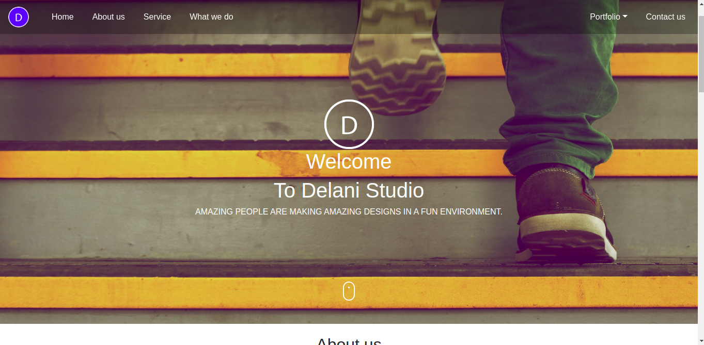
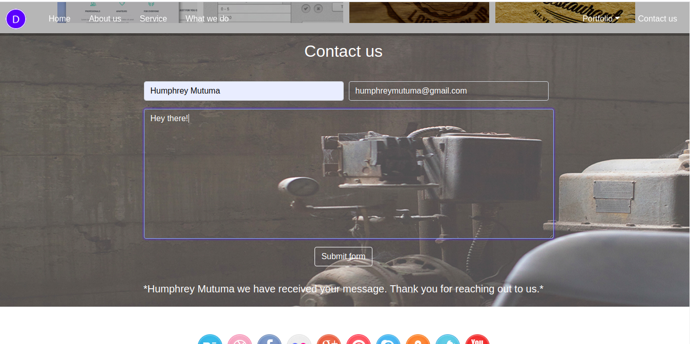

# Delani studio

# Home page.

### Author name: Humphrey mutuma.

#### Project description:
This is a delani studio responsive, mobile first, webpage. 

The page has a navigation bar positioned fixed at the top of the webpage, through which you can navigate to all sections of the webpage easily without having to scroll all along.

The page has the home page, an about us section, the what we do section, a portfolio section showing some of the projects done with their titles being displayed when you hover over it, a contact us form that you can input your name, email address and the message and some social icons at the bottom of the page.

#### Contact us form.
When you submit the form you get a pop up message just below the form, with your name and a ' thank you' message. This shows your message has been sent successfully.

Project setup instructions: You can fork this projects from GitHub.
# BDD

| Inputs  | Description  |
|---|---|
|Name  | Here you will add your name.  |
| email  | Here you will enter your valid email.  |
| Message  |  This is the message that you will be sending us. |

| Output  | Description  |
|---|---|
|Name   | A pop up will appear with your name and a thank you message . This shows that we have received your message.|
|Error   | If you submit empty form , you get a popup message telling you you did not enter a name or email or message|	
### Technologies used;
> HTML

> CSS

>Bootstrap

>JavaScript

> JQuery

>Markdown

 ### Development
Want to contribute? Great!

To fix a bug or enhance an existing module, follow these steps:

- Fork the repo

- Create a new branch (git checkout -b improve-feature)

- Make the appropriate changes in the files

- Add changes to reflect the changes made

- Commit your changes (git commit -am 'Improve feature')

- Push to the branch (git push origin improve-feature)

- Create a Pull Request

#### Demo : 
Here is the link to live demo [Click me](https://humphrey-mutuma.github.io/Delani-studio/)

Copyright and license information: This project is licensed under the terms of the [MIT license.](#)
